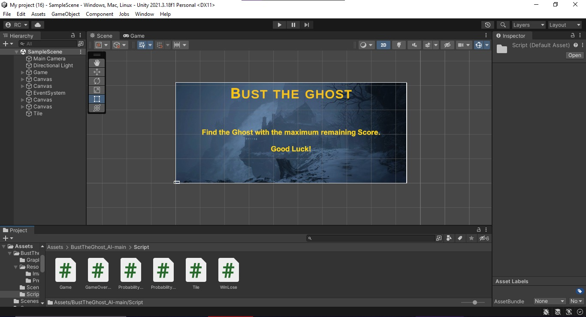
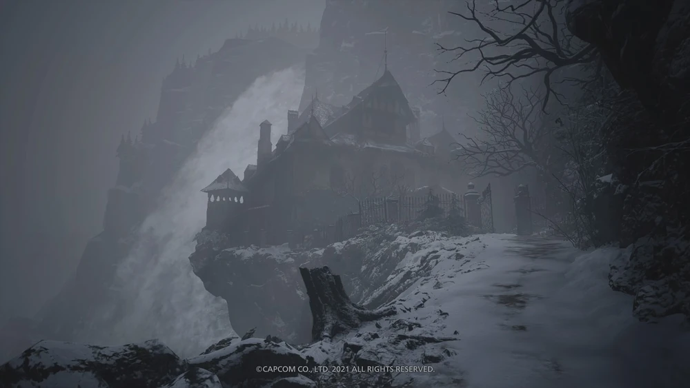

# 🎮 Bust the Ghost


An intelligent Unity-based game that uses probabilistic inferencing to create an engaging ghost-hunting experience. Test your deduction skills as you track down hidden ghosts using sensor data and probability calculations!

## 📺 Demo Video

[](https://youtu.be/ufYvbSCznzs)

**Direct Link:** https://youtu.be/ufYvbSCznzs

## 📖 About The Project

**Bust the Ghost** is an AI-powered game developed in Unity that demonstrates practical applications of probabilistic reasoning and inference algorithms. Players must locate hidden ghosts on a grid using sensor readings and Bayesian probability updates. Each sensor provides information about nearby ghost locations, and players must use logical deduction to pinpoint the exact position.

The game showcases how probabilistic inferencing can be applied in interactive environments, making it both educational and entertaining.

## 🎯 How to Play

1. **Objective:** Find and bust all hidden ghosts on the game grid
2. **Sensors:** Use sensors to detect ghost proximity - they provide probability distributions
3. **Inference:** Analyze sensor data to deduce ghost locations
4. **Bust:** Click on suspected locations to bust the ghosts
5. **Win:** Successfully locate all ghosts to win the game!

### Controls
- **Mouse Click:** Place sensors and bust ghosts
- **UI Buttons:** Navigate menus and reset game

## 🚀 Installation

### Option 1: Play from Source
1. Clone the repository:
   ```bash
   git clone https://github.com/Adnane-Ahroum/BustTheGhost.git
   ```
2. Extract `AI_Project.rar`
3. Open the project in Unity (2019.x or later recommended)
4. Open the main scene and press Play

### Option 2: Download Build
- Download the pre-built game from the repository files
- Extract and run the executable

## 🛠️ Tech Stack

- **Game Engine:** Unity
- **Programming Language:** C#
- **AI Techniques:** 
  - Probabilistic Inferencing
  - Bayesian Probability Updates
  - Sensor Fusion Algorithms
- **Assets:** Custom sprites and UI elements

## ✨ Features

- 🧠 **Intelligent AI System:** Advanced probabilistic reasoning engine
- 📊 **Real-time Probability Visualization:** See probability distributions update as you play
- 🎨 **Polished UI:** Clean, intuitive interface with visual feedback
- 🏆 **Victory Conditions:** Clear win/lose states with feedback
- 🔄 **Replayability:** Randomized ghost positions for unique gameplay each time
- 📈 **Educational Value:** Learn about Bayesian inference through gameplay

## 📸 Screenshots

### Game Scene


### Gameplay


### Victory Screen


## 📄 Documentation

For detailed information about the project implementation and AI algorithms, see [AIProject3.pdf](AIProject3.pdf).

## 👨‍💻 Author

**Adnane Ahroum**
- GitHub: [@Adnane-Ahroum](https://github.com/Adnane-Ahroum)
- Project Link: [https://github.com/Adnane-Ahroum/BustTheGhost](https://github.com/Adnane-Ahroum/BustTheGhost)

## 📝 License

This project is licensed under the MIT License - see below for details:

```
MIT License

Copyright (c) 2024 Adnane Ahroum

Permission is hereby granted, free of charge, to any person obtaining a copy
of this software and associated documentation files (the "Software"), to deal
in the Software without restriction, including without limitation the rights
to use, copy, modify, merge, publish, distribute, sublicense, and/or sell
copies of the Software, and to permit persons to whom the Software is
furnished to do so, subject to the following conditions:

The above copyright notice and this permission notice shall be included in all
copies or substantial portions of the Software.

THE SOFTWARE IS PROVIDED "AS IS", WITHOUT WARRANTY OF ANY KIND, EXPRESS OR
IMPLIED, INCLUDING BUT NOT LIMITED TO THE WARRANTIES OF MERCHANTABILITY,
FITNESS FOR A PARTICULAR PURPOSE AND NONINFRINGEMENT. IN NO EVENT SHALL THE
AUTHORS OR COPYRIGHT HOLDERS BE LIABLE FOR ANY CLAIM, DAMAGES OR OTHER
LIABILITY, WHETHER IN AN ACTION OF CONTRACT, TORT OR OTHERWISE, ARISING FROM,
OUT OF OR IN CONNECTION WITH THE SOFTWARE OR THE USE OR OTHER DEALINGS IN THE
SOFTWARE.
```

## 🙏 Acknowledgments

- Unity Technologies for the game engine
- AI and probabilistic reasoning concepts from academic research
- Open source community for inspiration

---

⭐ **Star this repository if you find it interesting!**
